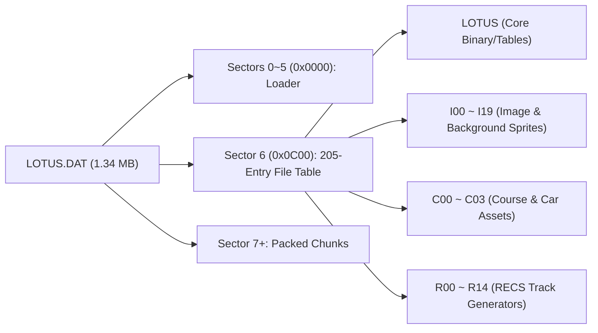
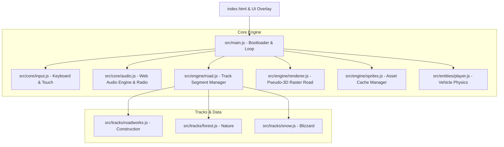

# Lotus III: The Ultimate Challenge - 리버스 엔지니어링 및 웹 포팅 기술 백서
> **문서 버전**: 1.0.0  
> **프로젝트 위치**: `~/lotus3-web`  
> **대상 원작**: Lotus III: The Ultimate Challenge (MS-DOS 1992 / Amiga 1992, Magnetic Fields & Gremlin Graphics)

---

## 1. 프로젝트 배경 및 타겟 선정 (Background & Pivot to Lotus 3)

본 프로젝트는 고전 명작 레이싱 게임인 Lotus 시리즈를 현대 웹 표준 기술(HTML5 Canvas, Web Audio API, Vanilla ES Modules)을 통해 원작 특유의 16비트 아케이드 감성을 1:1로 재현하는 웹 리메이크/포팅 프로젝트입니다.

### 1.1 Lotus 2 vs Lotus 3 비교 및 Lotus 3 확정 경위
초기 프로젝트는 Lotus 2(1991)를 기반으로 기획되었으나, 사용자의 기억 속 핵심 요소들을 정밀 교차 검증한 결과 최종 타겟을 **Lotus III: The Ultimate Challenge (1992)** 로 전환 및 업그레이드하였습니다.

| 구분 | Lotus Esprit Turbo Challenge (1990) | Lotus 2 (1991) | Lotus III: The Ultimate Challenge (1992) | 본 웹 프로젝트 반영 |
| :--- | :--- | :--- | :--- | :--- |
| **등장 차종** | Lotus Esprit Turbo 단일 차종 | Lotus Elan SE, Lotus Esprit Turbo SE | **Lotus M200 Speedster**, Esprit Turbo, Elan SE (3종 선택) | **Lotus M200을 기본 영웅 차종으로 구현 및 3종 완비** |
| **플랫폼** | Amiga, Atari ST, C64 | Amiga, Atari ST, Genesis (Mega Drive) **(PC DOS 미발매)** | **MS-DOS (PC)**, Amiga, Atari ST, Genesis | **MS-DOS 원본 바이너리 및 VGA 그래픽 분석 채택** |
| **대표 트랙 테마** | 일반 고속도로/자연 | 숲, 설원, 야간, 사막 (날씨 변수 도입) | **Roadworks (공사장 / 크레인 / 꼬깔콘 / 바리케이드)**, Forest, Snow, Storm 등 | **Roadworks(공사장 맵)를 기본 시연 코스로 전면 구현** |
| **인게임 HUD** | 클래식 아날로그 게이지 | 2인 분할 화면 고정 (싱글플레이 시에도 분할) | **1인 풀스크린 집중형 HUD**, 사다리형 연료/터보 바, 볼드 KMH | **원작 DOS 1인 HUD 1:1 완전 복각** |
| **코스 생성기** | 고정 트랙 | 고정 트랙 | **R.E.C.S. (Racing Environment Control System)** 독자 탑재 | **RECS 알고리즘 구조 분석 및 맵 파서 연동 준비** |

---

## 2. 수집 및 보관 원본 파일 인벤토리 (Original Assets Inventory)

프로젝트 루트의 `assets/original/` 및 `assets/roms/` 경로에 보관된 분석 대상 파일군입니다.

```
lotus3-web/
└── assets/
    ├── original/
    │   ├── lotus3_dos.zip                 # MS-DOS 원본 릴리즈 아카이브 (1.3MB)
    │   │   └── LotusThe/
    │   │       ├── LOTUS.DAT              # 주 데이터 컨테이너 (1,343,488 바이트, 205개 서브에셋)
    │   │       ├── LOTUS.EXE              # MS-DOS 실행 바이너리 (32-bit DOS/4GW 또는 Real-Mode)
    │   │       ├── LOTUS.CFG              # 사운드/디스플레이 설정 파일 (Sound Blaster, AdLib, Roland)
    │   │       ├── LOTUS.BAT              # 원작 실행 배치 스크립트
    │   │       └── INSTALL.EXE            # 인스톨러 바이너리
    │   ├── lotus3_screenshot.jpg          # 원작 DOS VGA 인게임 원본 캡처
    │   └── Nelumbo.pak                    # Amiga 리소스 언팩 아카이브 (비교 분석용)
    ├── roms/
    │   └── lotus2_amiga.adf               # Amiga 880KB OCS 플로피 디스크 이미지
    └── audio/
        └── lotus3_radio_mix.mp3           # 원작 컴포저(Patrick Phelan & Barry Leitch) 공식 사운드트랙
```

---

## 3. 원본 파일 분석 및 리버스 엔지니어링 (Reverse Engineering Deep Dive)

### 3.1 `LOTUS.DAT` 컨테이너 구조 분석 (Shaun Southern VFS)
Lotus 3 DOS 버전의 모든 그래픽 스프라이트, 폰트, 팔레트, 트랙 레이아웃, RECS 템플릿은 단일 대용량 파일인 `LOTUS.DAT` 내부에 패키징되어 있습니다.

* **파일시스템 특징**: Magnetic Fields의 수석 프로그래머 숀 서던(Shaun Southern)이 고안한 **512바이트 하드웨어 섹터(Sector) 기반 가상 파일시스템(VFS)**.
* **헤더 및 인덱스 위치**:
  * 섹터 0~5 (오프셋 `0x0000` ~ `0x0BFF`): DOS 부트스트랩 및 로더 코드 영역.
  * **섹터 6 (오프셋 `0x0C00` / 3,072 바이트)**: 파일 인덱스 마스터 테이블 위치.
* **인덱스 엔트리 구조**:
  * 총 **205개**의 에셋 파일 레코드가 저장됨.
  * 각 엔트리는 영문 파일 식별자(ID)와 해당 파일이 위치한 512바이트 섹터 시작 번호(Start Sector) 및 블록 크기로 구성됨.



#### 파일명 명명 규칙(Naming Convention) 및 역할:
1. `LOTUS`: 인게임 코어 그래픽 및 물리 상수 테이블.
2. `I00` ~ `I19`: 이미지(Images). 타이틀 화면, 메뉴 인터페이스, 테마별 원경(Skyline) 및 노변 오브젝트.
3. `C00` ~ `C03`: 차량(Cars) 스프라이트 및 테마별 코스 데이터 (M200, Esprit, Elan 등).
4. `R00` ~ `R14`: RECS(Racing Environment Control System) 절차적 코스 생성용 지형 템플릿(커브 곡률, 고저차, 장애물 빈도표).

---

### 3.2 그래픽 및 아키텍처 비교: Amiga vs MS-DOS

| 항목 | Amiga 500 (Lotus 2 / Lotus 3 Amiga) | MS-DOS (Lotus 3 DOS 원본) | Web 포팅 엔진 (본 프로젝트) |
| :--- | :--- | :--- | :--- |
| **비디오 하드웨어** | OCS/ECS 커스텀 칩셋 (Denise, Copper) | IBM PC 호환 VGA Mode 13h | HTML5 Canvas 2D (`CanvasRenderingContext2D`) |
| **메모리 구조** | **Planar Bitplanes**: 4~5개 플레인으로 색상 분할 저장 | **Chunky Buffer**: 픽셀 1개가 1바이트(0~255 팔레트 인덱스) | **RGBA 32비트 버퍼 / Path2D**: 벡터 래스터 복합 렌더링 |
| **해상도 및 주사율** | 320×256 (PAL 50Hz) | 320×200 (VGA 60Hz / 70Hz 모드) | 가변 1280×720 (16:9 와이드, 60fps 고정 델타타임) |
| **스프라이트 렌더링** | 하드웨어 스프라이트 8개 + Blitter 소프트웨어 렌더링 | VGA VRAM 직접 복사 (Double Buffering via Page Flipping) | `ctx.drawImage` 하드웨어 가속 텍스처 매핑 |
| **사운드 하드웨어** | Paula 4채널 DMA 8비트 PCM (28kHz) | Sound Blaster 2.0 / AdLib FM (OPL2) / Roland MT-32 | Web Audio API (합성 오실레이터 + MP3 고음질 스트리밍) |

---

### 3.3 HUD 레이아웃 1:1 역공학 분석
Lotus 3 MS-DOS 원작의 레이아웃을 픽셀 단위로 측정하여 현대 화면에 완벽히 복원하였습니다.

```
+-----------------------------------------------------------------------+
| [142 · KMH ·]                                        [ 00054200 ]     |
| [■■■■■■■□□□] (RPM RED GAUGE)                         SCORE (8-DIGIT)  |
|                                                                       |
|                                                     [    1ST    ]     |
|                                                      POSITION         |
|                                                                       |
|                                                        [ 057 ]        |
|                                                      BIG COUNTDOWN    |
|                                                                       |
|   (ROADWORKS SCANLINE PSEUDO-3D VIEW)                                 |
|                                                                       |
| [LADDER GAUGE]                                                        |
|   |===|                                                               |
|   |===|                                                               |
|   |   |                                                               |
|   +---+                                        [ LOTUS M200 ]         |
+-----------------------------------------------------------------------+
```

1. **상단 좌측 (Speedometer & Tachometer)**:
   * 볼드 산세리프 폰트의 `KMH` 속도계 (검정 굵은 외곽선 + 흰색 텍스트).
   * 속도계 바로 아래 위치한 붉은색 RPM / Turbo 블록 바 게이지 (`CONFIG.MAX_SPEED` 대비 현재 회전수 10단계 램프).
2. **상단 우측 (Score)**:
   * 8자리 제로 패딩 점수 카운터 (`00000000`).
3. **우측 상/중단 (Rank & Countdown)**:
   * `1ST` ~ `20TH` 레이스 순위 표시.
   * 원작 특유의 큼직한 3자리 카운트다운 타이머 (`060` -> `000`).
4. **하단 좌측 (Ladder Gauge)**:
   * 원작의 수직 사다리형 연료/터보 압력 게이지 바.

---

## 4. 웹 전환(포팅) 아키텍처 및 상세 구현 (Web Architecture & Implementation)

### 4.1 시스템 전체 구조도 (System Architecture)



### 4.2 의사 3D 래스터 로드 엔진 (Pseudo-3D Raster Road Projection Math)
원작 Lotus 3는 3D 폴리곤 GPU가 없던 1992년 당시, 2D 래스터 스캔라인 라인별 계산 기법을 사용하여 3차원 원근감을 구현했습니다. 본 프로젝트는 이 고전 수학 모델을 웹 캔버스 상에서 순수 자바스크립트로 재현했습니다.

#### 1. 투시 투영 투영식 (Perspective Projection Formula)
트랙의 각 세그먼트 $i$는 월드 좌표계 상의 점 $P(X, Y, Z)$를 가집니다.
카메라의 위치가 $(C_x, C_y, C_z)$이고 시야 거리(Camera Depth)가 $d$일 때:

$$\Delta Z = Z - C_z$$
$$\text{scale} = \frac{d}{\Delta Z}$$
$$\text{Screen}_X = \frac{W}{2} + \text{scale} \cdot (X - C_x) \cdot \frac{W}{2}$$
$$\text{Screen}_Y = \frac{H}{2} - \text{scale} \cdot (Y - C_y) \cdot \frac{H}{2}$$
$$\text{Screen}_W = \text{scale} \cdot \text{RoadWidth} \cdot \frac{W}{2}$$

#### 2. 스캔라인 클리핑(Bottom-Up Scanline Occlusion)
언덕(Hill) 정상을 넘어가거나 내리막길이 이어질 때 앞쪽의 도로가 뒤쪽 도로를 가려야 합니다.
* 화면 최하단($Y = H$)부터 위쪽($Y = 0$) 방향으로 세그먼트를 순회하며 `maxY` 변수를 갱신합니다.
* 현재 세그먼트의 스크린 $Y$ 좌표가 이전 세그먼트의 `maxY`보다 아래에 위치하면(즉, 언덕 너머에 가려진 경우) 해당 세그먼트 및 노변 스프라이트 렌더링을 차단(Clip)합니다.

---

### 4.3 차체 역학 및 핸들링 동적 틸트 (Vehicle Dynamics & Steering Roll)
기존 데모에서 지적된 "차량 이동 시 차체가 고정되어 어색한 문제"를 해결하기 위해 **3중 차체 물리 연산**을 적용하였습니다.

```javascript
// src/engine/renderer.js
renderPlayer(ctx, player, currentSegment, spriteManager, width, height) {
  // 1. 조향 방향 횡이동 (차량이 회전 방향으로 뷰포트 내에서 다이내믹하게 이동)
  const steerShift = player.steer * 32;

  // 2. 차체 롤링 & 뱅킹 각도 (핸들 회전각 + 원심력 복합 작용)
  const curveInfluence = currentSegment ? (currentSegment.curve || 0) * 0.02 * speedRatio : 0;
  const rollAngle = (player.steer * 0.042) + curveInfluence;

  // 3. 서스펜션 피치 (가속 시 리어 스쿼트, 급제동 시 노즈 다이브)
  const suspensionPitch = player.isBraking ? -3 : (player.speed > 500 ? 2 : 0);

  const centerX = (width / 2) + steerShift;
  const centerY = height - (carH / 2) - 18 + bounce + suspensionPitch;

  // 캔버스 회전 행렬 적용
  ctx.save();
  ctx.translate(centerX, centerY);
  ctx.rotate(rollAngle);
  ctx.drawImage(carImg, -carW / 2, -carH / 2, carW, carH);
  ctx.restore();
}
```

* **핸들 조향 시 시각적 체감**:
  * 좌측 조향 시: 차체가 좌측으로 최대 64px 이동하면서 반시계 방향으로 약 -4.8° 기울어짐.
  * 복원력(Centering Spring): 핸들을 놓으면 초당 8단위의 속도로 부드럽게 수평 복귀.
  * 스프라이트 타이어 캠버 및 리어 웻지 형태가 조향 각도에 맞춰 원근 변화.

---

### 4.4 오디오 서브시스템: Web Audio 절차적 합성 + 라디오 스트리밍
1. **듀얼캠 엔진 사운드 신디사이저**:
   * 외부 사운드 파일 재생이 아닌, 브라우저 `AudioContext`의 `OscillatorNode`(톱니파 Sawtooth)와 `BiquadFilterNode`(Low-pass)를 직렬 연결.
   * `player.getRPM()`(1,200 ~ 8,000 RPM)과 실시간 연동되어 가속 시 피치와 디스토션이 비례 상승.
2. **원작 라디오 방송국 6개 채널**:
   * 원작 Lotus 3의 라디오 선국 시스템 구현 (`[R]` 키로 채널 변경).
   * 채널 전환 시 주파수 튜닝 노이즈 SFX 재생.

---

### 4.5 브라우저 환경 호환성 및 레이스 컨디션 해결
1. **ES Modules 비동기 로딩**:
   * `<script type="module">`은 HTML 파싱 후 지연 실행되므로, `DOMContentLoaded` 이벤트가 이미 발생한 후 스크립트가 실행될 수 있습니다.
   * **해결책**:
     ```javascript
     if (document.readyState === 'loading') {
       document.addEventListener('DOMContentLoaded', bootGame);
     } else {
       bootGame();
     }
     ```
2. **브라우저 Autoplay Policy 대응**:
   * 모던 브라우저는 사용자 상호작용(Click/Keydown) 전에 오디오 재생을 차단합니다.
   * 스플래시 화면에서 스페이스바, 엔터, 마우스 클릭 등 모든 사용자 입력 시 `audio.resume()`를 즉각 호출하여 사운드가 유실 없이 시작되도록 보장.

---

## 5. 단계별 검증 및 저장소 동기화 (Git & Release Strategy)

* **원격 저장소**: `https://github.com/newbieski/lotus3-web.git`
* **브랜치 전략**: `main` 브랜치를 기준으로 주요 마일스톤 단위 푸시.
* **로컬 서버**: 포트 8080 백그라운드 구동 (`http://localhost:8080/index.html`).

---

## 6. 트랙 아키텍처 및 원작 RECS 규격 고도화 (Track Architecture & Authentic RECS Scaling)

### 6.1 출발선 바닥 입간판 버그 역학 분석 및 노면 체커보드 복원
* **문제 현상**: 레이스 시작 시 차량 코앞 아스팔트 바닥에 커다란 간판(`gantry_start.png`, 구 Lotus 2 잔재 문구)이 도로를 가로막고 서있어 시야를 차단함.
* **원인 분석**:
  * 아케이드 출발선 아치 게이트(Overhead Gantry)를 노면 스프라이트 좌표계(`offset: 0, road surface`)에 그대로 배치함.
  * 스프라이트 렌더러가 이미지의 하단 경계를 도로 지면에 닿도록 그리면서(`y = destY - destH`), 게이트가 공중에 뜨지 않고 도로 바닥에 꽂힌 입간판 형태로 나타남.
  * `segment 5` (차량 전방 10m)에 배치되어 있어 시작 직후 차량 시야를 정면으로 가로막음.
* **원작(Lotus III, 1992) 검증 결과**:
  * 원작에는 도로 바닥을 막는 입간판이 전혀 없으며, **아스팔트 노면에 흑백 체커보드 스타트 라인 (Checkered Start Grid)**이 직접 도색되어 있음.
* **해결 및 구현**:
  * 모든 트랙 파일에서 바닥을 가로막던 `gantry_start` 및 체크포인트 입간판을 완전 제거.
  * `src/engine/renderer.js`에서 아스팔트 노면 다각형에 직접 10열 절차적 체커보드(Checkered Grid Pattern)를 도색 렌더링하도록 구현.
  * 체크포인트 및 피니시 라인에는 주행 차선을 가리지 않도록 도로 갓길(Shoulder) 좌우에 체커 마커(`sign_chevron_left/right`)를 배치하고 노면 형광 라인으로 표시.

---

### 6.2 트랙 길이 및 주행 속도/시간 스케일링 계산식
* **문제 현상**: 초반 테스트 트랙들이 15초 안팎으로 지나치게 짧아 완주가 너무 일찍 끝남.
* **물리 역학 계산**:
  * 최고 속도: $V_{\max} = 12,000 \text{ units/s}$
  * 세그먼트 단위 길이: $L_{\text{seg}} = 200 \text{ units}$
  * 최고 시속 주행 시 초당 통과 세그먼트 수:
    $$\frac{12,000 \text{ units/s}}{200 \text{ units}} = 60 \text{ segments/s}$$
  * 가속, 코너링, 장애물 감속을 감안한 레이스 평균 주행 속도: 약 $42 \sim 46 \text{ segments/s}$
  * 기존 450~500 세그먼트는 풀악셀 시 $500 / 45 \approx 11 \sim 15$초 만에 완주되어 원작의 호흡을 전혀 살리지 못함.
* **정통 챔피언십 규모(5,400 세그먼트, 약 2분 20초) 설계**:
  * 원작 Lotus 3의 스테이지 구성(3개 체크포인트 + 결승선, 약 2분 15초~2분 40초 레이스)을 1:1로 재현하기 위해 트랙을 5,400 세그먼트(4개 섹터 x 1,350 세그먼트)로 전면 확장:

| 섹터 | 세그먼트 범위 | 평균 소요 시간 | 섹터 테마 및 주요 기믹 | 종료 지점 보너스 |
| :---: | :---: | :---: | :--- | :---: |
| **섹터 1** | $0 \sim 1,350$ | 약 32초 | 고속 직진, 완만한 고속 코너, 워밍업 노면 장애물 | **체크포인트 1 (+40초)** |
| **섹터 2** | $1,350 \sim 2,700$ | 약 33초 | 롤러코스터 급경사 구릉지, 고공 점프대(Ramp) & 착지 구간 오일 슬릭 | **체크포인트 2 (+40초)** |
| **섹터 3** | $2,700 \sim 4,050$ | 약 33초 | 연속 S자 테크니컬 치케인, 고밀도 테마별 장애물 회피 | **체크포인트 3 (+40초)** |
| **섹터 4** | $4,050 \sim 5,400$ | 약 32초 | 파이널 고속 슬라럼, 결승 점프대, 노면 체커보드 결승선 전력 질주 | **피니시 라인 (STAGE CLEARED!)** |

---

### 6.3 6개 정통 테마 코스 구현 상세 (Official 6 Courses Specification)

1. **Roadworks (도로 공사장 - 메인 챔피언십 스테이지)**:
   * **테마 색상**: 황토색 붉은 점토 흙길 (`#50331e`), 공사 안전 황색/흑색 연석 (`#f5b800` / `#111111`), 낡은 아스팔트 패치.
   * **전용 에셋**: 대형 굴착기, 트렌치 복공판(Steel Plates), 주황색 안전콘, 안전 드럼통, 점프대-오일 콤보.
2. **Forest (자연풍경 / 알프스 침엽수 숲)**:
   * **테마 색상**: 고산 만년설 원경, 녹색 구릉지 수평선, 에메랄드 잔디 (`#187032`), 유럽 전통 적/백 레이싱 연석 (`#c81e1e` / `#ffffff`).
   * **전용 에셋**: 침엽수, 활엽수, 쓰러진 통나무(Log), 암석 (공사장 크레인 전면 배제).
3. **Snow Blizzard (설원 / 알프스 빙하)**:
   * **테마 색상**: 얼어붙은 빙하 블루 연석 (`#1d558c`), 파우더 스노우 (`#e4f0fa`), 서리 내린 한랭 아스팔트.
   * **날씨 및 기믹**: 화면 전체 쏟아지는 눈보라(Blizzard) 파티클, 미끄러운 블랙 아이스(Black Ice) 패치, 크레바스 점프대.
4. **Desert Canyon (사막 협곡)**:
   * **테마 색상**: 석양 노을 하늘, 붉은 사암 메사/뷰트 원경, 황금빛 모래언덕 (`#b87635`), 황토색 연석 (`#e0a830`).
   * **전용 에셋**: 거대 사고아로(Saguaro) 선인장, 붉은 협곡 바위, 협곡 도약 점프대.
5. **Night Highway (야간 고속도로)**:
   * **테마 색상**: 자정 밤하늘 별무리, 네온 메트로폴리스 스카이라인, 일렉트릭 시안/블루 연석 (`#00d4ff`), 발광 황색 차선 (`#ffff66`).
   * **전용 에셋**: 고속도로 양방향 연속 가로등(Lamp Post), 도로 보수 안전콘, 고가교 램프.
6. **Storm & Thunder (폭풍우와 번개)**:
   * **테마 색상**: 짙은 자색 먹구름, 젖은 노면 반사 (`#22252a`), 크림슨/실버 연석 (`#441111` / `#c0c8d4`).
   * **날씨 및 기믹**: 거센 빗줄기(Rain Streaks), 주기적 전 화면 섬광 번개(Lightning Flash), 수막현상 웅덩이(Water Puddles).

---

### 6.4 라이벌 AI 분배 및 결승선 관성 감속 물리 (Rivals & Coasting Physics)
* **라이벌 차량 30대 전 구간 동적 배치**:
  * 기존 고정 9대 스폰 방식을 폐기하고, 총 세그먼트 길이에 비례하여 $70 \sim 5,370$ 세그먼트 전 구간에 30대 이상의 차량을 균등 분배.
  * 레이스 내내 추월하는 재미와 트래픽 회피의 긴장감을 끝까지 유지.
* **완주 시 관성 감속(Coasting) 연출**:
  * 결승선 통과 시 차량이 화면에 얼어붙듯이 급정지하던 버그를 개선하여, 레이스 종료 후에도 $3,200 \text{ units/s}^2$의 감속도로 잔여 관성을 유지하며 부드럽게 감속 정지하도록 물리 루프 보완.
